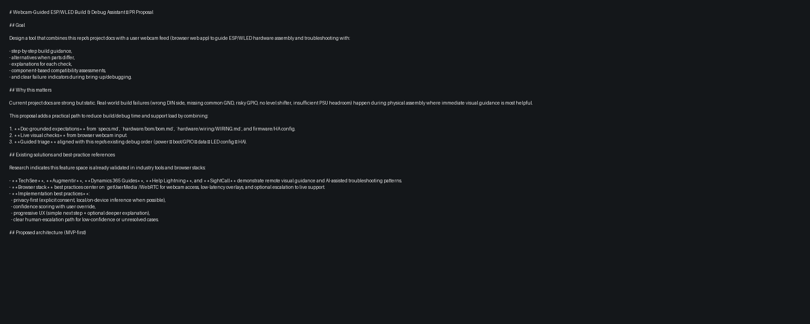

# Webcam-Guided ESP/WLED Build & Debug Assistant — PR Proposal

## Goal

Design a tool that combines this repo's project docs with a user webcam feed (browser web app) to guide ESP/WLED hardware assembly and troubleshooting with:

- step-by-step build guidance,
- alternatives when parts differ,
- explanations for each check,
- component-based compatibility assessments,
- and clear failure indicators during bring-up/debugging.

## Why this matters

Current project docs are strong but static. Real-world build failures (wrong DIN side, missing common GND, risky GPIO, no level shifter, insufficient PSU headroom) happen during physical assembly where immediate visual guidance is most helpful.

This proposal adds a practical path to reduce build/debug time and support load by combining:

1. **Doc-grounded expectations** from `specs.md`, `hardware/bom/bom.md`, `hardware/wiring/WIRING.md`, and firmware/HA config.
2. **Live visual checks** from browser webcam input.
3. **Guided triage** aligned with this repo's existing debug order (power → boot/GPIO → data → LED config → HA).

## Existing solutions and best-practice references

Research indicates this feature space is already validated in industry tools and browser stacks:

- **TechSee**, **Augmentir**, **Dynamics 365 Guides**, **Help Lightning**, and **SightCall** demonstrate remote visual guidance and AI-assisted troubleshooting patterns.
- **Browser stack** best practices center on `getUserMedia`/WebRTC for webcam access, low-latency overlays, and optional escalation to live support.
- **Implementation best practices**:
  - privacy-first (explicit consent, local/on-device inference when possible),
  - confidence scoring with user override,
  - progressive UX (simple next step + optional deeper explanation),
  - clear human-escalation path for low-confidence or unresolved cases.

## Proposed architecture (MVP-first)

### 1) Web client (primary)

- Browser UI with webcam capture (`getUserMedia`).
- Step engine that maps expected assembly state per project/step.
- On-screen checklist + visual prompts (e.g., "show controller top view", "show first LED DIN label").
- Local inference first for lightweight detections/classifiers where feasible.

### 2) Guidance API (service)

- Loads project-specific expected configuration from repo-backed artifacts.
- Evaluates rule checks and generates "next best step" guidance.
- Stores session-safe telemetry (events, confidence, outcomes) without raw video by default.

### 3) Optional vision backend

- Handles heavier model inference when client-side confidence is low.
- Accepts frame snapshots only when user consents.
- Returns detection + confidence + rationale for UI explanation.

### 4) Knowledge retrieval layer

- Pulls project-specific facts from:
  - `<project>/specs.md`
  - `<project>/hardware/bom/bom.md`
  - `<project>/hardware/wiring/WIRING.md`
  - `<project>/firmware/cfg.json`
  - `<project>/firmware/platformio_override.ini` (when relevant)
- Produces component-aware checks and alternatives tied to project definition.

## Guided UX flow

1. **Session start**
   - Select project + symptom (`LEDs dark`, `flicker`, `wrong colors`, `no Wi-Fi`, `no HA discovery`, etc.).
   - Grant camera permission (with clear privacy notice).
2. **Pre-power checklist**
   - Validate PSU class and target strip voltage.
   - Confirm common GND presence.
   - Confirm level shifter presence for 5V data strips.
3. **Assembly validation**
   - Prompt camera framing per component.
   - Detect key wiring landmarks and connector orientation.
   - Mark step pass/warn/fail with explanation.
4. **Failure triage mode**
   - Follow deterministic diagnostic sequence:
     - Power path
     - Boot/controller state
     - Data path
     - LED configuration
     - Home Assistant integration
5. **Outcome**
   - "Ready to test", "Likely fix applied", or "Escalate" package with evidence snapshot + checklist state.

## Component-based assessments

Per project session, assess:

- **Controller board**: family match (ESP32/ESP8266), risky boot pins used/not used.
- **LED strip**: protocol/voltage expectations, DIN orientation, configured LED count consistency.
- **Power subsystem**: expected current budget vs PSU rating/headroom, injection recommendations.
- **Data path**: GPIO mapping, level shifter requirement/status, signal-route plausibility.
- **Integration layer**: mDNS/device naming and expected HA entity readiness checks.

## Failure indicators (examples)

| Indicator | Likely cause | Suggested next check |
|---|---|---|
| LED strip fully dark, controller online | Data path issue, wrong DIN side, no common GND | Verify DIN arrow direction, shared GND continuity, configured GPIO vs physical wire |
| Random flicker / unstable colors | Signal integrity / level mismatch / noisy power | Confirm level shifter, shorten data lead, verify injection and GND quality |
| Wrong colors (e.g. white/pink mismatch) | Color order/chipset mismatch | Re-check WLED chipset + color order setting |
| Boots inconsistently | Strapping pin conflict or unstable power | Move data pin off risky boot pins; verify 5V stability |
| WLED works, HA missing device | mDNS/discovery/config issue | Verify `cfg.json` mDNS keys and network discoverability |

## Privacy and safety requirements

- Explicit camera consent before use.
- Default to local processing; server upload only for explicit escalation.
- No raw video persistence by default.
- Redact/avoid capturing credentials or unrelated personal environment where possible.
- Include manual override for all automated judgments.

## Proposed phased roadmap

### Phase 1 — MVP (single project target: `reefs`)

- Browser workflow with symptom selection and guided checks.
- Rule-based checker against project docs (no heavy CV required).
- Snapshot-based manual confirmation + lightweight detection hooks.
- Session report export (checklist + likely fault area + next steps).

### Phase 2 — CV-assisted checks

- Add model-assisted detection for key assembly states:
  - board presence/orientation,
  - LED DIN side recognition,
  - common wiring anomalies.
- Confidence thresholds with "I'm not sure" fallback prompts.

### Phase 3 — Multi-project + escalation

- Generalize for `curtaincinemalights` and future projects.
- Add live escalation mode (share annotated stills/checklist to reviewer).
- Add analytics loop for top failure patterns and doc improvements.

## Proposed repo change plan for implementation PR

- Add a new top-level tool folder (e.g. `tools/webcam_build_assistant/`) with:
  - web client prototype,
  - rule/check engine,
  - project-doc adapter,
  - privacy-safe session logging.
- Add project adapters for `reefs` first, then `curtaincinemalights`.
- Add docs:
  - architecture overview,
  - data/privacy policy,
  - contribution guide for new failure rules and project adapters.

## Acceptance criteria for initial implementation

- User can complete a guided session for `reefs` in browser with webcam permission flow.
- Tool detects/flags at least core assembly-risk states (power/data/GND/GPIO mismatch prompts).
- Tool returns a deterministic triage path and actionable next step.
- Session output is generated without storing raw video by default.
- Guidance remains grounded in project docs and current repo rules.

## External references used for this proposal

- TechSee: https://techsee.me/
- Augmentir: https://www.augmentir.com/
- Dynamics 365 Guides: https://dynamics.microsoft.com/en-us/mixed-reality/guides/
- MDN `getUserMedia`: https://developer.mozilla.org/en-US/docs/Web/API/MediaDevices/getUserMedia
- WebRTC: https://webrtc.org/
- TensorFlow.js: https://www.tensorflow.org/js
- MediaPipe: https://mediapipe.dev/
