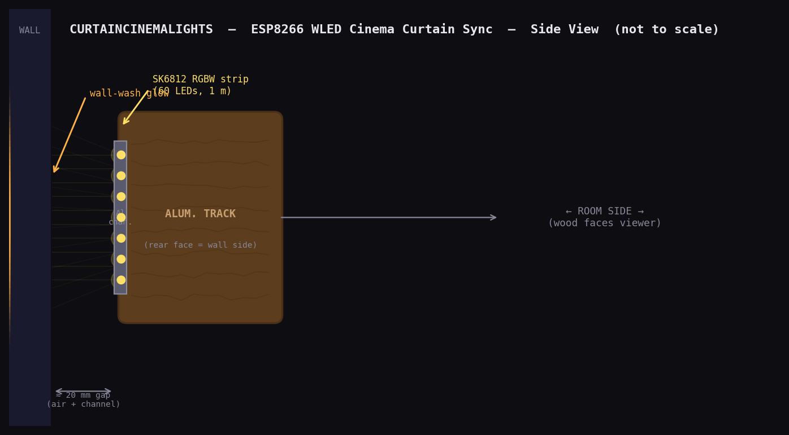
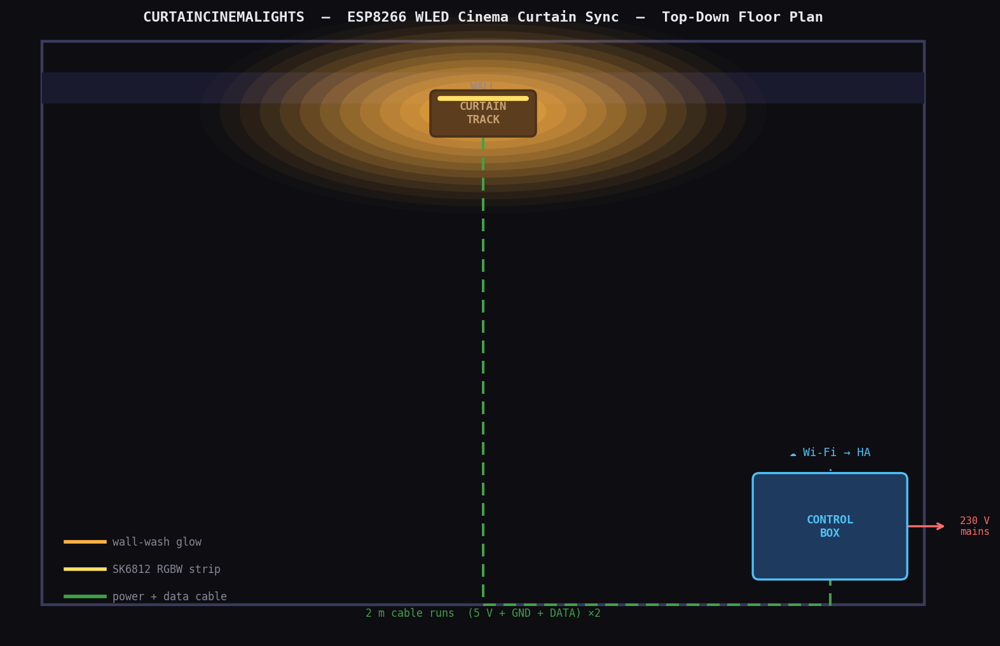
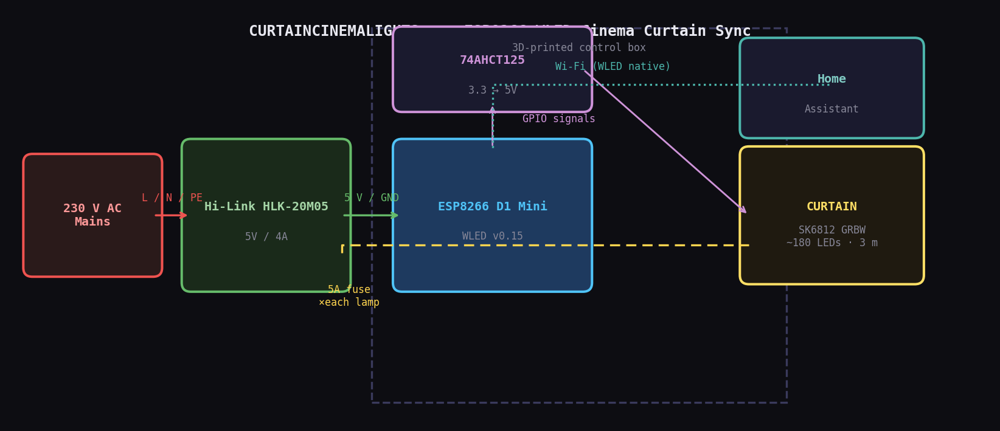
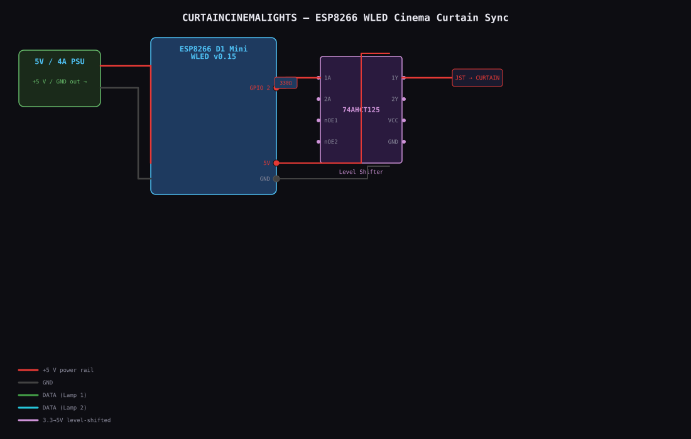
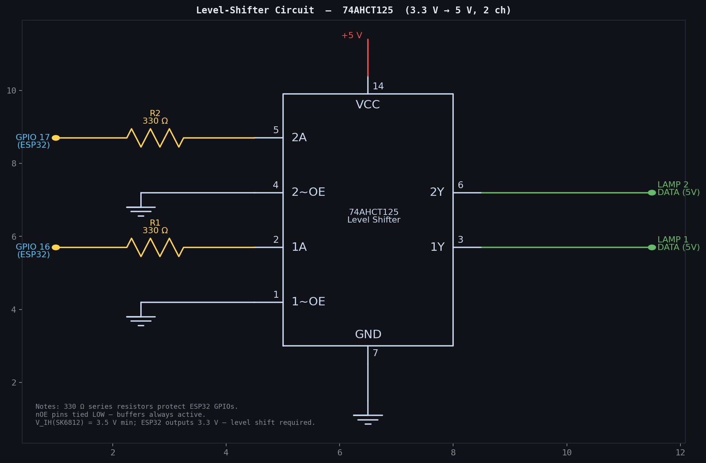
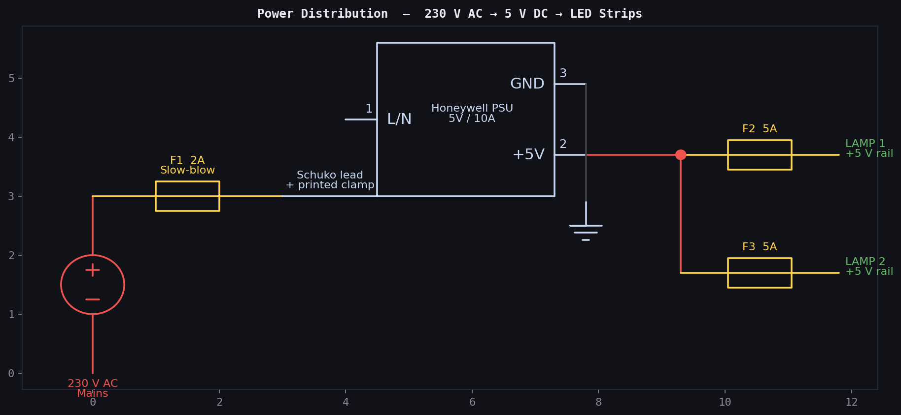
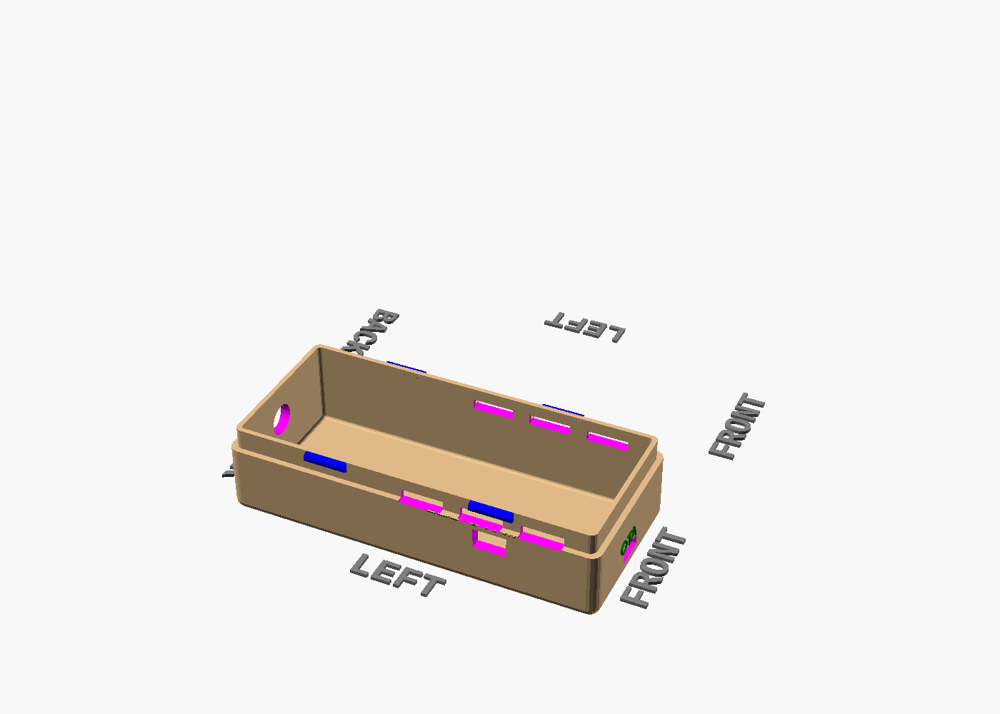
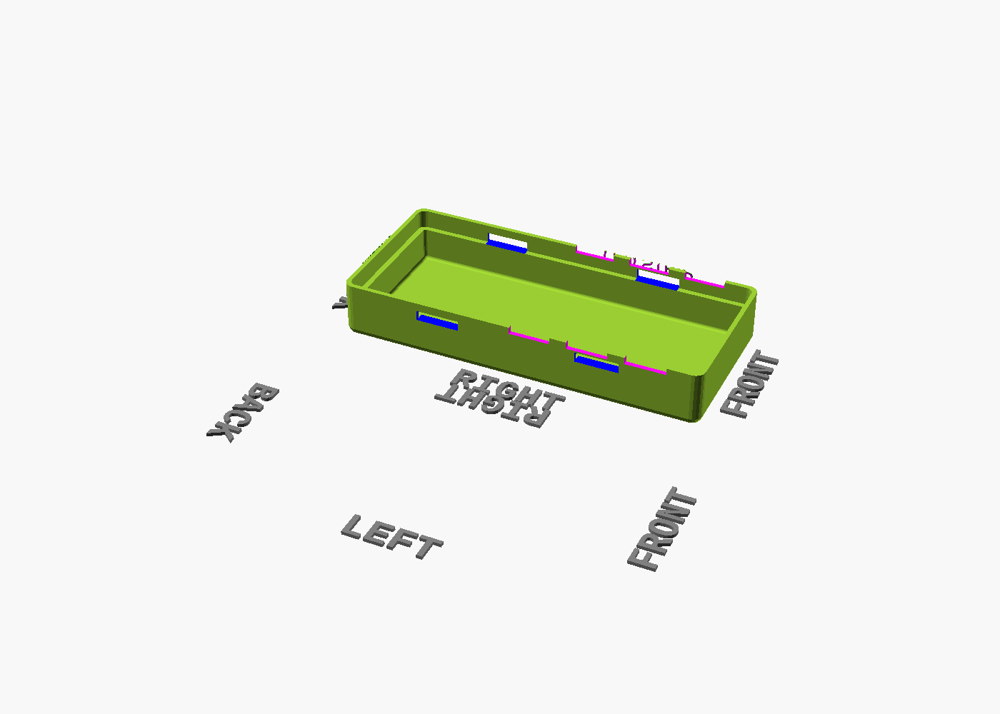

# curtaincinemalights — Cinema Curtain LED Sync

> A single SK6812 RGBW strip hidden in a curtain-rail channel mirrors the open and close position of a motorized cinema curtain, driven by WLED and Home Assistant state-based effects.

## Concept

This project hides one 5 V SK6812 RGBW strip behind a red cinema curtain so the LEDs illuminate the wall-gap between fabric and wall rather than the room directly. The lit zone starts at the center and spreads outward to match the two-panel curtain motion in real time.

The whole effect is built around one ESP8266 D1 Mini running WLED, a compact AC-DC supply inside a printed enclosure, and Home Assistant orchestration through `hacs-wledext-effects` for State Sync, Chase, and Breathe behaviors.

---

## Quick Facts

| Property | Value |
|----------|-------|
| Controller | ESP8266 LOLIN D1 Mini v4 |
| WLED version | v0.15 (ESP8266 branch) |
| LED strip | SK6812 RGBW 60 LED/m, 5 V, GRBW |
| Default LED count | 180 LEDs (3 m), adjustable in WLED UI |
| Output pin | GPIO2 (D4) via 74AHCT125 |
| PSU | Hi-Link HLK-20M05, 5 V / 4 A |
| WLED ABL limit | 3200 mA |
| Segments | Left Panel (0–89, reversed) + Right Panel (90–179) |
| HA mDNS hostname | `curtaincinemalights.local` |
| HA master entity | `light.curtaincinemalights` |
| Context effects | State Sync, Chase, Breathe, Rainbow Wave |
| Enclosure | 3D-printed YAPP_Box, ~106 × 46 × 44 mm, snap-on lid |

---

## Key Components / Parts Snapshot

| PART_ID | Role | Register-backed facts | Source / Pinout |
|---|---|---|---|
| `D1_MINI_V4` | Controller board | 34.2 × 25.6 × 10 mm body; USB-C port cutout guidance in register; no mounting holes so enclosure uses a friction-fit pocket | [Board page](https://www.wemos.cc/en/latest/d1/d1_mini.html) |
| `HLK_20M05` | AC-DC supply | 56 × 32 × 22.5 mm body; 85–264 Vac input; 5 V / 4 A output | [LCSC listing](https://lcsc.com/product-detail/Power-Modules_HI-LINK-HLK-20M05_C465406.html) |
| `SK6812_RGBW_60` | LED strip | 10 mm strip width; GRBW colour order; power injection recommended every ≤ 50 LEDs | [Datasheet](https://cdn-shop.adafruit.com/product-files/1138/SK6812+LED+datasheet+.pdf) |
| `AL_LED_CHANNEL_12MM` | Aluminium channel | 12.3 mm inner width; 17.4 × 7.6 mm outer profile; works as both diffuser carrier and heat spreader | [Profile reference](https://www.superlightingled.com/light-diffuser-aluminum-led-profile-for-12mm-flexible-led-strip-lights-p-4554.html) |
| `IC_74AHCT125_DIP14` | Data level shifter | 5 V TTL-compatible buffer; DIP-14 package; one gate used to raise ESP8266 data to 5 V logic | [TI datasheet](https://www.ti.com/product/SN74AHCT125) |
| `JST_SM_2P5_3PIN` | Strip connector | 3 A/contact; 9.5 × 6 mm wall pocket; common LED-strip connector format | [Series reference](https://www.jst-mfg.com/product/pdf/eng/eSM.pdf) |

---

## Documentation Index

| Document | What's inside |
|-----|----------|
| [specs.md](specs.md) | Full project spec, requirements, acceptance criteria, HA integration plan |
| [hardware/bom/bom.md](hardware/bom/bom.md) | Bill of materials, power budget, connector strategy |
| [hardware/wiring/WIRING.md](hardware/wiring/WIRING.md) | Wiring guide, pin allocation, 74AHCT125 pinout |
| [design/led-map/LED-DESIGN.md](design/led-map/LED-DESIGN.md) | Segment layout, curtain-position to LED mapping |
| [design/effects/ha-automations.yaml](design/effects/ha-automations.yaml) | Home Assistant template sensor, helpers, and automations |
| [mechanical/enclosure/MODELS.md](mechanical/enclosure/MODELS.md) | Enclosure print specs, file list, re-render command |
| [mechanical/enclosure/curtaincinemalights-enclosure.scad](mechanical/enclosure/curtaincinemalights-enclosure.scad) | Current enclosure source |
| [firmware/cfg.json](firmware/cfg.json) | WLED config: device name, segments, GPIO, ABL |
| [firmware/platformio_override.ini](firmware/platformio_override.ini) | PlatformIO build override for ESP8266 D1 Mini |
| [firmware/presets.json](firmware/presets.json) | WLED presets |
| [firmware/spiffs/ha-import.html](firmware/spiffs/ha-import.html) | Device-served HA import assistant |
| [homeassistant/README.md](homeassistant/README.md) | Home Assistant import guide |
| [homeassistant/package.yaml](homeassistant/package.yaml) | HA package with helpers, scripts, and automations |
| [homeassistant/lovelace.yaml](homeassistant/lovelace.yaml) | Ready-made dashboard card |

---

## Wiring & Schematics

See [hardware/wiring/WIRING.md](hardware/wiring/WIRING.md) for GPIO allocation, midpoint power injection, and 74AHCT125 wiring details.

| Level Shifter | Power Supply |
|:-------------:|:------------:|
|  |  |

---

## Enclosure

The enclosure source is [mechanical/enclosure/curtaincinemalights-enclosure.scad](mechanical/enclosure/curtaincinemalights-enclosure.scad). It packages the HLK-20M05, D1 Mini, fuse, and connector routing into a compact YAPP_Box-style shell sized for shelf or curtain-alcove installation.

| Base shell | Lid |
|:----------:|:---:|
|  |  |

Re-render: `pwsh tools/render_enclosure.ps1 -Project curtaincinemalights -ScadName curtaincinemalights-enclosure`

---

## Build Checklist

- [ ] Measure exact curtain width and set final LED count / segment split
- [ ] Flash WLED v0.15 to the D1 Mini and verify captive portal setup
- [ ] Bench-test GPIO2 through the 74AHCT125 into a short SK6812 segment
- [ ] Cut and mount the aluminium channel on the curtain-rail brackets
- [ ] Wire start and midpoint power injection for the final strip length
- [ ] Print the enclosure and verify HLK-20M05 + D1 Mini fit
- [ ] Upload `cfg.json`, `presets.json`, and `ha-import.html`
- [ ] Verify Home Assistant discovery and import the package / blueprints
- [ ] Configure State Sync, Chase, Breathe, and Rainbow Wave instances
- [ ] Test opening, closing, cinema mode, and thermal behavior

---

## Adjusting for Your Curtain Width

| Width | LED count | Segment split | WLED setting |
|-------|-----------|---------------|--------------|
| 2.0 m | 120 | 0–59 + 60–119 | Change total LEDs and segment stops in WLED UI |
| 2.5 m | 150 | 0–74 + 75–149 | Same pattern |
| 3.0 m (default) | 180 | 0–89 + 90–179 | Default config |
| 4.0 m | 240 | 0–119 + 120–239 | Same pattern |

---

## Resources

- [specs.md](specs.md) — full project spec
- [homeassistant/README.md](homeassistant/README.md) — Home Assistant import guide
- [tools/parts-register/parts.json](../tools/parts-register/parts.json) — shared part facts used across the repo
- [WLED Docs](https://kno.wled.ge)
- [WLED GitHub](https://github.com/wled/WLED)
