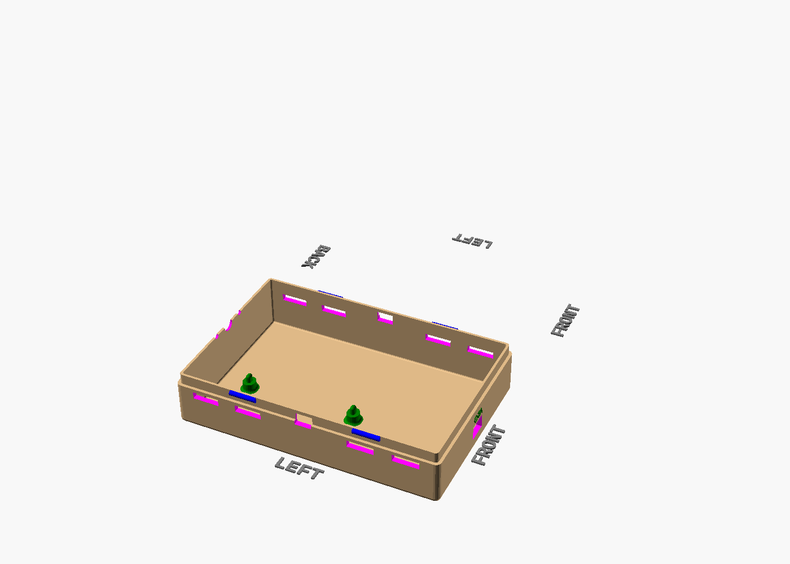
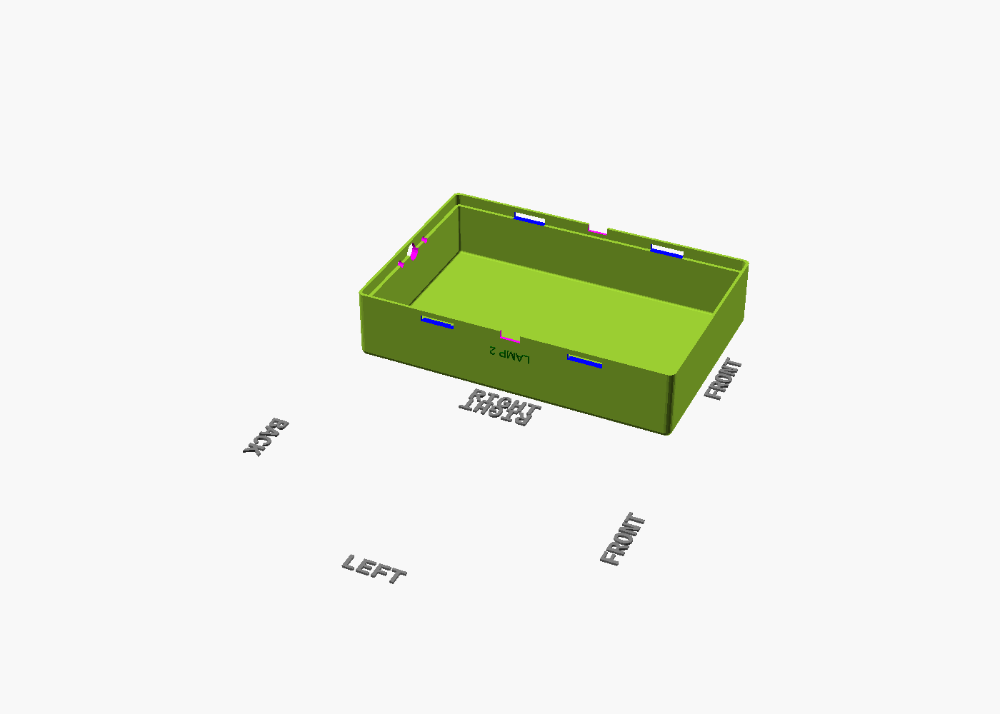

# reefs — Driftwood Ambient Lamps

> Two driftwood wall-wash lamps powered by SK6812 RGBW strips, a shared ESP8266 NodeMCU V3/WLED controller, and a compact 3D-printed control box with Home Assistant integration.

## Concept

Each piece of driftwood is treated as its own lamp: a 1 m SK6812 RGBW strip sits in an aluminium channel on the rear face of the wood and throws diffused light onto the wall behind it. The front stays visually dark, so the shape and grain of the driftwood frame the glow rather than being lit directly.

Both lamps run back to one concealed control box. That box handles the 5 V power distribution, level-shifted data outputs, WLED configuration, and Home Assistant discovery while keeping the installation to a single mains lead and two lamp cable runs.

---

## Quick Facts

| Property | Value |
|---|---|
| Board | ESP8266 NodeMCU V3 (LoLin/Wemos-style) |
| LED Type | SK6812 RGBW, 5 V, 60 LED/m, GRBW |
| LED Count | 120 total (60 per lamp × 2) |
| Power Supply | Honeywell 5 V / 10 A external PSU |
| WLED Version | v0.15 (ESP8266 branch) |
| Smart home | Home Assistant native WLED integration |
| Outputs | D5/GPIO14 → Lamp 1, D6/GPIO12 → Lamp 2 via 74AHCT125 |
| Enclosure | 3D-printed PETG / ASA control box, snap-on lid |

---

## Key Components / Parts Snapshot

| PART_ID | Role | Register-backed facts | Source / Pinout |
|---|---|---|---|
| `ESP8266_NODEMCU_V3` | Reference controller board | `nodemcuv2` PlatformIO target; recommended LED pins are D5/GPIO14 and D6/GPIO12; UNVERIFIED clone-derived geometry so confirm your board's size and USB position before enclosure edits | [Board page](https://www.nodemcu.com/index_en.html) |
| `SK6812_RGBW_60` | LED emitters | 10 mm strip width; GRBW colour order; inject power every ≤ 50 LEDs on longer runs | [Datasheet](https://cdn-shop.adafruit.com/product-files/1138/SK6812+LED+datasheet+.pdf) |
| `AL_LED_CHANNEL_12MM` | Heat-spreading channel | 12.3 mm inner width; 17.4 × 7.6 mm outer profile; helps move heat away from wood and diffuser | [Profile reference](https://www.superlightingled.com/light-diffuser-aluminum-led-profile-for-12mm-flexible-led-strip-lights-p-4554.html) |
| `IC_74AHCT125_DIP14` | Data level shifter | 5 V supply; TTL-compatible inputs accept 3.3 V logic; quad buffer lets one gate drive each lamp output | [TI datasheet](https://www.ti.com/product/SN74AHCT125) |
| `JST_SM_2P5_3PIN` | Lamp connector interface | 3 A/contact; 9.5 × 6 mm panel pocket; common prewired connector format for addressable LED strips | [Series reference](https://www.jst-mfg.com/product/pdf/eng/eSM.pdf) |

The Honeywell PSU used here is project-specific and is not yet represented in the shared parts register.

---

## Documentation Index

| Document | What's inside |
|---|---|
| [specs.md](specs.md) | Full PRD: concept, requirements, power budget, WLED config, HA integration |
| [hardware/bom/bom.md](hardware/bom/bom.md) | Bill of materials, current budget, voltage-drop notes |
| [hardware/wiring/WIRING.md](hardware/wiring/WIRING.md) | GPIO assignments, control-box wiring, connector strategy |
| [design/led-map/LED-DESIGN.md](design/led-map/LED-DESIGN.md) | Segment plan, preset design, colour strategy |
| [design/effects/ha-automations.yaml](design/effects/ha-automations.yaml) | Home Assistant automation examples |
| [mechanical/enclosure/MODELS.md](mechanical/enclosure/MODELS.md) | Print settings, enclosure notes, cutout details |
| [mechanical/enclosure/reefs-automatedvariant-enclosure.scad](mechanical/enclosure/reefs-automatedvariant-enclosure.scad) | Current enclosure source |
| [firmware/platformio_override.ini](firmware/platformio_override.ini) | WLED build config |
| [firmware/cfg.json](firmware/cfg.json) | WLED runtime config |
| [firmware/presets.json](firmware/presets.json) | Exported WLED presets |
| [firmware/spiffs/ha-import.html](firmware/spiffs/ha-import.html) | Device-served HA import assistant |
| [homeassistant/README.md](homeassistant/README.md) | HA import methods and entity ID guidance |
| [homeassistant/package.yaml](homeassistant/package.yaml) | HA package with helpers, scripts, and automations |
| [homeassistant/lovelace.yaml](homeassistant/lovelace.yaml) | Ready-made dashboard card |

---

## Wiring & Schematics

See [hardware/wiring/WIRING.md](hardware/wiring/WIRING.md) for the full GPIO table, current-limited connector notes, and control-box wiring details.

| Level-shifter circuit | Power distribution |
|---|---|
|  |  |

---

## Enclosure

The current enclosure source is [mechanical/enclosure/reefs-automatedvariant-enclosure.scad](mechanical/enclosure/reefs-automatedvariant-enclosure.scad). The generated build uses a captive Schuko mains lead, a front USB access slot, and JST SM lamp-output pockets rather than the older IEC / cable-gland concept.

| Base shell | Lid |
|---|---|
|  |  |

Re-render with `pwsh tools/render_enclosure.ps1 -Project reefs -ScadName reefs-automatedvariant-enclosure`.

---

## Build Checklist

- [ ] Flash WLED ESP8266 build to the NodeMCU V3 and verify Wi-Fi join
- [ ] Bench-test one SK6812 strip on D5/GPIO14 through the level shifter
- [ ] Bench-test both outputs on D5/GPIO14 + D6/GPIO12 with 60 LEDs each
- [ ] Mount aluminium channels on the driftwood rear faces
- [ ] Print the current enclosure variant and verify cable-entry fit
- [ ] Assemble control box: PSU, controller, level shifter, fuses, JST outputs
- [ ] Configure WLED: 2 outputs, 60 LEDs each, SK6812 GRBW, boot preset
- [ ] Upload `ha-import.html` and verify Home Assistant discovery
- [ ] Add WLED integration in Home Assistant and verify both lamp entities
- [ ] Perform 60-minute thermal soak at 50 % brightness

---

## Resources

- [specs.md](specs.md) — full project spec
- [homeassistant/README.md](homeassistant/README.md) — Home Assistant import guide
- [tools/parts-register/parts.json](../tools/parts-register/parts.json) — shared part facts used across the repo
- [WLED Docs](https://kno.wled.ge)
- [WLED GitHub](https://github.com/wled/WLED)
