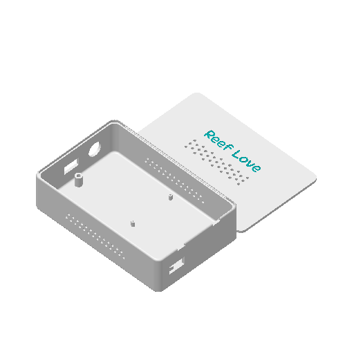

# Reef Love 🪵

> Two driftwood ambient lamps powered by SK6812 RGBW strips, an ESP32 running WLED, and a single 3D-printed control box — fully integrated with Home Assistant.

---

## Overview

Each piece of driftwood is a self-contained lamp. An SK6812 RGBW LED strip (60 LEDs, 1 m) is mounted in an aluminium channel on the **rear face** of the wood, casting diffused wall-wash light behind it. The room-facing side stays dark, framing the glow through the wood grain.

Both lamps run from one control box: a Honeywell 5 V / 10 A PSU and an ESP32 running WLED, enclosed in a custom 3D-printed case. WLED exposes each lamp as an independent segment — individually controllable from Home Assistant or the WLED web UI.

| | |
|---|---|
| **Lamps** | 2 × driftwood pieces |
| **LED strip** | SK6812 RGBW, 5 V, 60 LED/m, 1 m each |
| **Controller** | ESP32-WROOM-32 + WLED |
| **PSU** | Honeywell 5 V / 10 A (50 W) |
| **Smart home** | Home Assistant via native WLED integration |
| **Enclosure** | 3D-printed custom box (~150 × 100 × 60 mm) |

---

## Control Box Enclosure

The 3D project file is at [`3d/CustomProjectEnclosureV1.7.8b.3mf`](3d/CustomProjectEnclosureV1.7.8b.3mf).



> Printed in PETG or ASA. Ventilation slots on all sides for PSU convection. IEC C14 inlet cutout, USB-C access port for OTA recovery, and two PG9 cable glands for the lamp runs.

---

## Spec Document

Full PRD with wiring diagrams, BOM, power budget, and WLED config: **[specs.md](specs.md)**

### Quick-links to spec sections

| Section | Description |
|---|---|
| [§1 — Product Overview](specs.md#1-product-overview) | Summary, executive overview, success criteria |
| [§2 — Goals & Non-Goals](specs.md#2-goals) | What is and isn't being built |
| [§4 — Functional Requirements](specs.md#4-functional-requirements) | User stories GH-001 through GH-010 |
| [§8.1 — System Architecture](specs.md#81-system-architecture) | Full ASCII wiring diagram |
| [§8.2 — Bill of Materials](specs.md#82-bill-of-materials) | 16-item BOM with specs |
| [§8.3 — Power Budget](specs.md#83-power-budget) | Per-lamp current draw, PSU sizing |
| [§8.4 — Wiring Detail](specs.md#84-wiring-detail) | Control box internals, cable spec, voltage drop |
| [§8.5 — WLED Configuration](specs.md#85-wled-configuration) | GPIO assignments, LED count, colour order |
| [§8.6 — GPIO Pin Assignment](specs.md#86-gpio-pin-assignment-esp32) | Safe pins, strapping pin warnings |
| [§8.7 — Enclosure Design](specs.md#87-3d-printed-enclosure-design-spec) | Print spec, dimensions, cutouts |
| [§9 — Milestones](specs.md#9-milestones--roadmap) | 11-step MVP checklist + v1.1/v2 roadmap |

---

## Build Checklist (MVP)

- [ ] Flash WLED to ESP32, verify Wi-Fi
- [ ] Bench-test SK6812 strip on GPIO 16
- [ ] Mount aluminium channels on driftwood rear faces
- [ ] Solder strips; bench-test both on GPIO 16 + 17
- [ ] Print enclosure v1
- [ ] Assemble control box (PSU, terminal block, ESP32, level shifter, fuses)
- [ ] Wire lamp cables; connect via JST connectors
- [ ] Configure WLED: 2 outputs, 60 LEDs each, SK6812 GRBW, boot preset
- [ ] Add WLED integration to Home Assistant; verify 2 light entities
- [ ] Mount lamps; conceal cables
- [ ] Thermal soak: 60 min at 50 % brightness — verify ≤ 45 °C on strip

---

## Repo Structure

```
reefs/
├── README.md          ← this file
├── specs.md           ← full PRD (wiring, BOM, WLED config)
└── 3d/
    ├── CustomProjectEnclosureV1.7.8b.3mf   ← BambuStudio project
    ├── case-preview.png                     ← isometric render
    └── case-top.png                         ← top-view render
```
