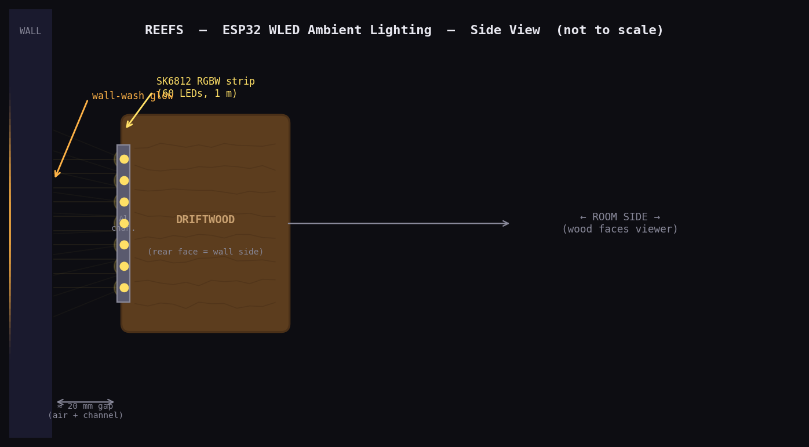
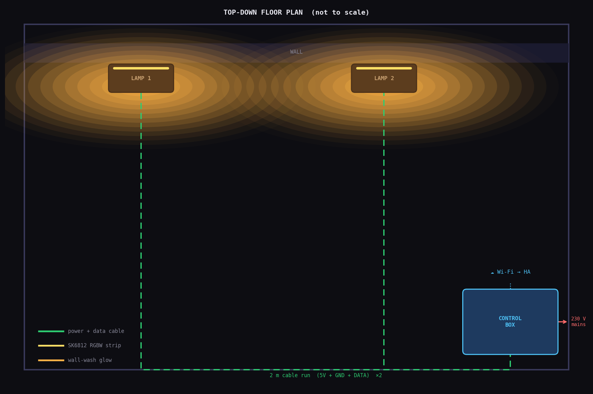
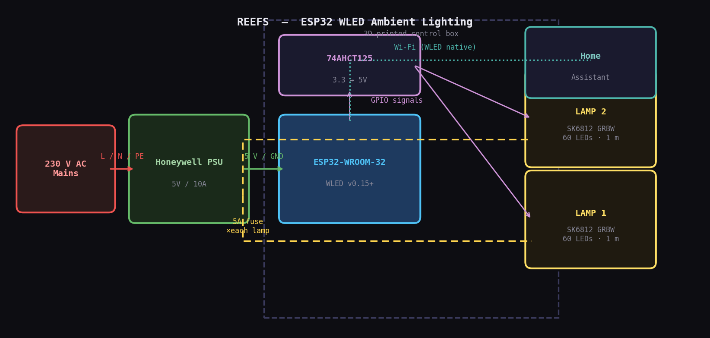
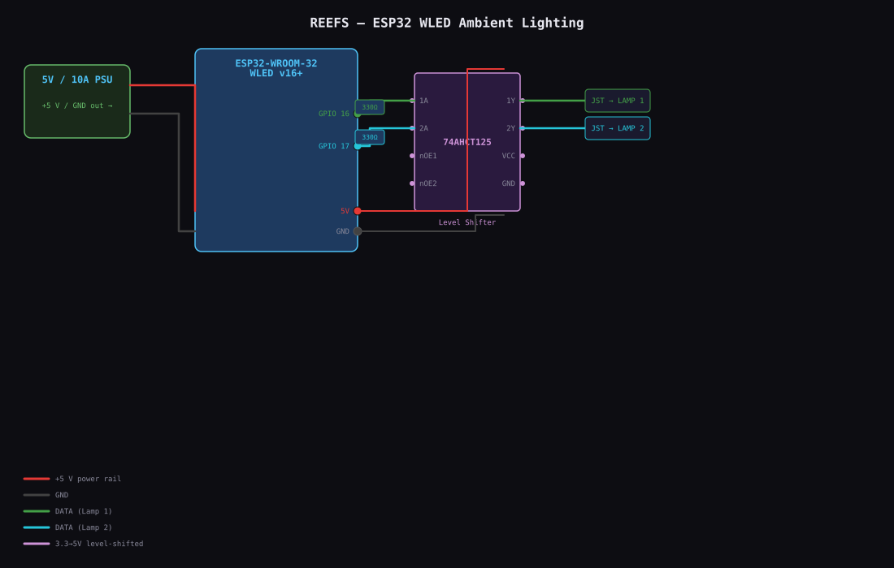

# Reef Love 🪵

> Two driftwood ambient lamps powered by SK6812 RGBW strips, an ESP32 running WLED, and a single 3D-printed control box — fully integrated with Home Assistant.

---

## Quick Facts

Each piece of driftwood is a self-contained lamp. An SK6812 RGBW LED strip (60 LEDs, 1 m) is mounted in an aluminium channel on the **rear face** of the wood, casting diffused wall-wash light behind it. The room-facing side stays dark, framing the glow through the wood grain.

Both lamps run from one control box: a Honeywell 5 V / 10 A PSU and an ESP32 running WLED, enclosed in a custom 3D-printed case. WLED exposes each lamp as an independent segment — individually controllable from Home Assistant or the WLED web UI.

| Property | Value |
|---|---|
| **Board** | ESP32-WROOM-32 |
| **LED Type** | SK6812 RGBW, 5 V, 60 LED/m |
| **LED Count** | 120 total (60 per lamp × 2) |
| **Power Supply** | Honeywell 5 V / 10 A (50 W) |
| **WLED Version** | v16+ |
| **Smart home** | Home Assistant (native WLED integration) |
| **Enclosure** | 3D-printed PETG box (~150 × 100 × 60 mm) |

---

## Concept

### Side View — How the wall-wash works

The LED strip sits in an aluminium channel on the **rear face** of the driftwood, pressed against the wall. Light spills between the wood and the wall surface, creating a diffused amber halo. The room-facing side of the wood stays dark.



### Top-Down Floor Plan — Two lamps, one control box

Both driftwood lamps mount along the same wall. Two 2 m cable runs (5 V + GND + DATA) route along the baseboard to the control box tucked in the corner.



### System Block Diagram

Power and data flow from mains → PSU → ESP32 + level shifter → both lamps, with Home Assistant reachable over Wi-Fi.



---

## Control Box Enclosure

The BambuStudio project file is at [`mechanical/enclosure/CustomProjectEnclosureV1.7.8b.3mf`](mechanical/enclosure/CustomProjectEnclosureV1.7.8b.3mf).


> Printed in PETG or ASA. Ventilation slots on all sides for PSU convection. IEC C14 inlet cutout, USB-C access port for OTA recovery, and two PG9 cable glands for the lamp runs.  
> Full print settings and cutout dimensions: [`mechanical/enclosure/MODELS.md`](mechanical/enclosure/MODELS.md).

---

## Documentation Index

| Document | What's inside |
|---|---|
| [specs.md](specs.md) | Full PRD: concept, requirements, power budget, BOM, WLED config, HA integration |
| [hardware/bom/bom.md](hardware/bom/bom.md) | Bill of materials, current budget, PSU sizing |
| [hardware/wiring/WIRING.md](hardware/wiring/WIRING.md) | GPIO assignments, power rails, cable runs |
| [design/led-map/LED-DESIGN.md](design/led-map/LED-DESIGN.md) | Segment plan, preset design, colour strategy |
| [design/effects/ha-automations.yaml](design/effects/ha-automations.yaml) | Home Assistant automation examples |
| [mechanical/enclosure/MODELS.md](mechanical/enclosure/MODELS.md) | 3D print settings, cutout dimensions |
| [firmware/platformio_override.ini](firmware/platformio_override.ini) | WLED build config (env, usermods, build flags) |
| [firmware/cfg.json](firmware/cfg.json) | WLED device config (mDNS, outputs, boot preset) |
| [firmware/presets.json](firmware/presets.json) | Exported WLED presets |

---

## Wiring & Schematics



See [hardware/wiring/WIRING.md](hardware/wiring/WIRING.md) for the full GPIO table and wiring notes.

| Level-shifter circuit | Power distribution |
|---|---|
|  |  |

---

## Build Checklist (MVP)

- [ ] Flash WLED to ESP32, verify Wi-Fi
- [ ] Bench-test SK6812 strip on GPIO 16
- [ ] Mount aluminium channels on driftwood rear faces
- [ ] Solder strips; bench-test both on GPIO 16 + 17
- [ ] Print enclosure v1
- [ ] Assemble control box (PSU, terminal block, ESP32, level shifter, fuses)
- [ ] Wire lamp cables; connect via JST connectors
- [ ] Configure WLED: 2 outputs, 60 LEDs each, SK6812 GRBW, boot preset
- [ ] Add WLED integration to Home Assistant; verify 2 light entities
- [ ] Mount lamps; conceal cables
- [ ] Thermal soak: 60 min at 50 % brightness — verify ≤ 45 °C on strip

---

## Repo Structure

```
reefs/
├── firmware/
│   ├── platformio_override.ini   ← WLED build config (env:esp32dev_reefs)
│   ├── cfg.json                  ← WLED device config (mDNS, outputs, boot preset)
│   └── presets.json              ← Exported WLED presets
├── hardware/
│   ├── bom/
│   │   └── bom.md                ← 16-item BOM with power budget
│   └── wiring/
│       └── WIRING.md             ← Wiring notes, GPIO table, references to diagrams
├── mechanical/
│   └── enclosure/
│       ├── CustomProjectEnclosureV1.7.8b.3mf  ← BambuStudio project
│       ├── case-preview.png
│       ├── case-top.png
│       └── MODELS.md             ← Print settings, cutout dimensions
├── design/
│   ├── led-map/
│   │   └── LED-DESIGN.md         ← Segment plan, preset design, white channel strategy
│   └── effects/
│       └── ha-automations.yaml   ← Example HA automations and Reef Scene script
├── docs/                         ← Auto-generated diagrams (do not hand-edit)
│   ├── concept-side-view.png
│   ├── concept-top-view.png
│   ├── concept-system.png
│   ├── schematic-level-shifter.png
│   ├── schematic-power.png
│   └── wiring-physical.svg
├── gen_diagrams.py               ← Diagram generation entry point (uses tools/diagram_gen)
├── gen_diagrams_config.py        ← DIAGRAM_CONFIG dict for this project
├── README.md                     ← this file
└── specs.md                      ← Full PRD (wiring, BOM, WLED config, HA integration)
```

---

## Resources

- [specs.md](specs.md) — full project spec
- [WLED Docs](https://kno.wled.ge)
- [WLED GitHub](https://github.com/wled/WLED)
- [WLED Discord](https://discord.gg/QAh7wJHrRM)
